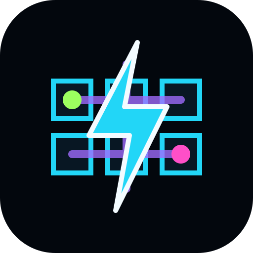

# Circuit Breaker+

Circuit Breaker+ is a mobile-first endless match-three puzzle game. Swap energized nodes, trigger cascades, create Line Breakers, and keep the system from reaching 100% heat.



## Features

- 7x7 match-three board with five node colors and distinct shapes.
- Tap, swipe, mouse, and keyboard-friendly controls.
- Cascades, score multipliers, heat gain, cooling rewards, and game-over stats.
- Straight four-matches create Line Breaker special nodes.
- Satirical fake interstitial ads with a fake $0.00 in-app purchase to bypass them.
- Deadlock detection and reshuffling.
- Saved best score, sound, haptics, and tutorial preferences with `localStorage`.
- Offline-ready PWA with a web app manifest and service worker.
- Static files only, with relative paths for GitHub Pages subdirectory hosting.

## Local Development

Serve the folder with any static web server:

```bash
python3 -m http.server 8000
```

Then open `http://localhost:8000/`.

Opening `index.html` directly is not recommended because service workers and ES modules are designed to run from a local server or static host.

## GitHub Pages Deployment

1. Push this project to a GitHub repository.
2. In the repository settings, enable GitHub Pages.
3. Choose the branch and folder that contain `index.html`.
4. Visit the generated Pages URL, such as `https://username.github.io/circuit-breaker-plus/`.

All runtime paths are relative, so the game can run from a repository subdirectory.

## PWA Notes

The first successful visit caches the HTML, CSS, JavaScript, manifest, and icon. After that, the game can load offline from the same browser. Some browsers show the install prompt only after their own engagement rules are met.

## Project Structure

```text
index.html
styles.css
manifest.webmanifest
service-worker.js
assets/
  icon.svg
js/
  audio.js
  board.js
  config.js
  game.js
  input.js
  main.js
  matches.js
  pwa.js
  renderer.js
  storage.js
  utils.js
```

Balance values live in `js/config.js`.

## Browser Support

Modern mobile and desktop browsers are supported. The game uses CSS Grid, ES modules, Web Audio, `localStorage`, and service workers.

## Known Limitations

- Screen-reader gameplay for the board is basic in this first version.
- PWA install availability depends on browser support.
- Audio starts only after a user gesture, which is required by browsers.

## Future Ideas

Daily challenges, timed survival, Pulse Bombs, Wildcard Cores, obstacles, local achievements, and shareable result cards are natural next additions.
