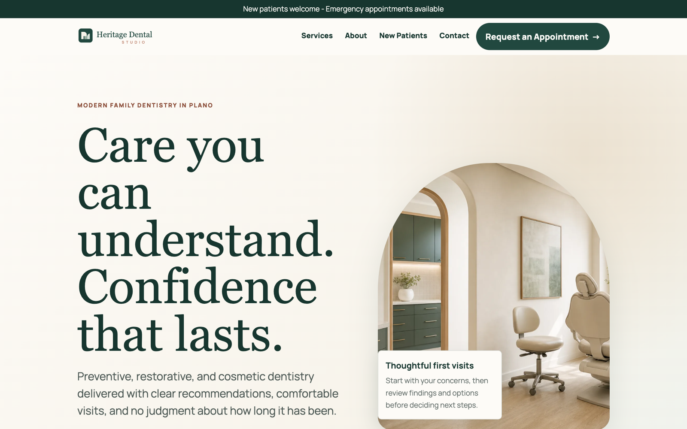
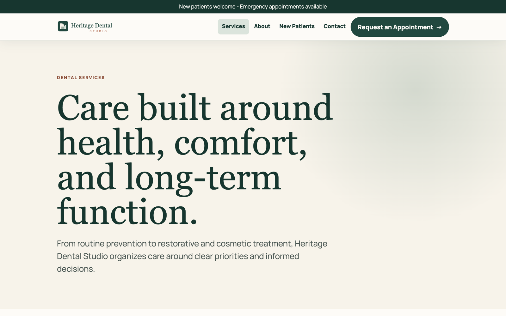
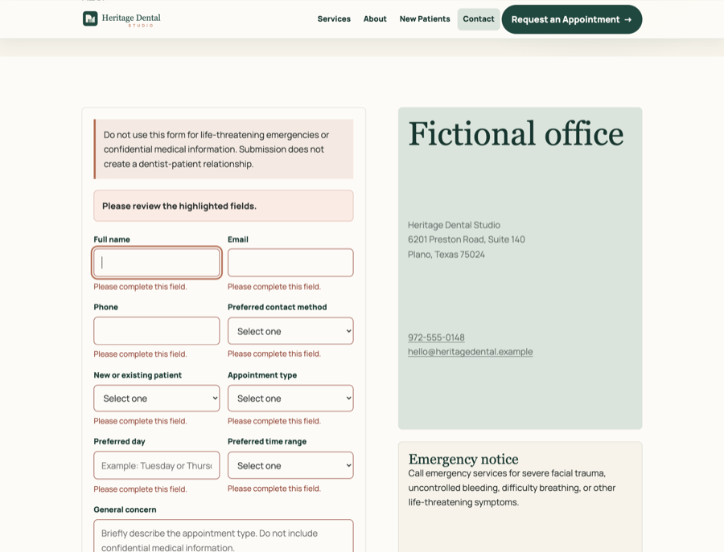
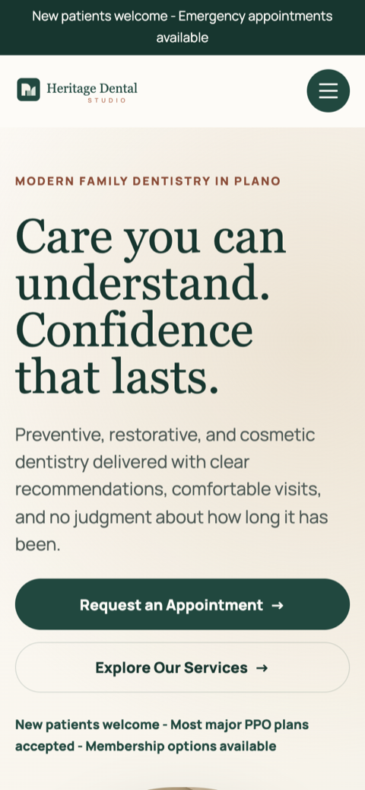

# Heritage Dental Studio

Heritage Dental Studio is a static portfolio website for a fictional modern neighborhood dental practice in Plano, Texas. The project demonstrates local-service website design, healthcare trust-building, service-page architecture, responsive front-end development, accessible forms, and brand identity implementation.

## Portfolio Disclaimer

Heritage Dental Studio is a fictional dental practice created as a brand identity, web design, and front-end development portfolio project by Matt Livingston. It does not provide dental care or medical advice.

No appointment is requested by this website, no form data is transmitted, and no dentist-patient relationship is created.

## Brand Summary

- Brand name: Heritage Dental Studio
- Tagline: Modern care. Lasting confidence.
- Supporting line: Thoughtful dentistry for every stage of life.
- Location concept: Plano, Texas
- Personality: warm, established, clear, modern, reassuring, professional, calm, and human

## Pages

- `index.html`
- `services.html`
- `about.html`
- `new-patients.html`
- `contact.html`
- `privacy.html`
- `disclaimer.html`
- `404.html`
- `services/preventive-care.html`
- `services/restorative-dentistry.html`
- `services/cosmetic-dentistry.html`
- `services/emergency-dentistry.html`
- `services/clear-aligners.html`

## Features

- Sticky responsive header
- Accessible mobile navigation with Escape-to-close and focus handling
- Homepage hero, trust strip, services, patient process, fictional doctor profile, technology section, membership panel, FAQ, and closing CTA
- Service index and five focused service detail pages
- New-patient onboarding page with sample form previews
- Static appointment request form with local validation and no data transmission
- Privacy and disclaimer pages for portfolio safety
- Custom 404 page
- Scroll-to-top control
- Reduced-motion support
- Active navigation state

## Technology

- Semantic HTML5
- Modern CSS with custom properties
- Vanilla JavaScript
- Inline SVG illustrations and local SVG brand assets
- No frameworks, build step, database, authentication, analytics, or form service

## File Structure

```text
/
|-- index.html
|-- services.html
|-- about.html
|-- new-patients.html
|-- contact.html
|-- privacy.html
|-- disclaimer.html
|-- 404.html
|-- favicon.svg
|-- site.webmanifest
|-- robots.txt
|-- sitemap.xml
|-- README.md
|-- services/
|   |-- preventive-care.html
|   |-- restorative-dentistry.html
|   |-- cosmetic-dentistry.html
|   |-- emergency-dentistry.html
|   `-- clear-aligners.html
`-- assets/
    |-- css/styles.css
    |-- js/main.js
    `-- images/
        |-- heritage-dental-logo.png
        |-- heritage-dental-logo.svg
        |-- heritage-dental-logo-light.svg
        |-- heritage-dental-monogram.svg
        |-- hero-dental-studio.png
        |-- hero-dental-studio.webp
        |-- office-interior.png
        |-- office-interior.webp
        |-- doctor-placeholder.png
        |-- doctor-placeholder.webp
        `-- screenshots/
```

## Local Usage

Open `index.html` directly in a browser, or serve the folder with any static server:

```bash
python3 -m http.server 8000
```

Then visit `http://localhost:8000/`.

## Deployment

This is a raw static site with no build step. It lives at:

`https://mattlivingston.com/portfolio/heritage-dental/`

Canonical links, Open Graph URLs, the JSON-LD `url` field, `robots.txt`, and `sitemap.xml` are already set to that path. To deploy elsewhere, update those references and republish `robots.txt`/`sitemap.xml` with the new base URL.

## Accessibility Notes

- Includes a skip link, landmarks, semantic headings, visible focus states, labeled form fields, field-specific errors, and reduced-motion styles.
- FAQ content remains present without JavaScript.
- The appointment form validates locally and preserves entered values after validation errors.

## Performance Notes

- No third-party scripts are installed.
- No analytics or tracking cookies are included.
- Brand assets are local SVGs plus the supplied PNG logo.
- Decorative visuals are CSS and SVG-based to avoid random remote stock images.

## Asset Information

The supplied `heritage-dental-logo.png` has been copied into `assets/images/`. The SVG logo files and favicon are local companion assets created for the static site. The hero, office interior, and Dr. Hart portrait images were generated for this fictional portfolio project and saved as PNG masters plus WebP page assets.

## Screenshots

**Homepage (desktop)**


**Services**


**Contact form validation**


**Homepage (mobile)**



